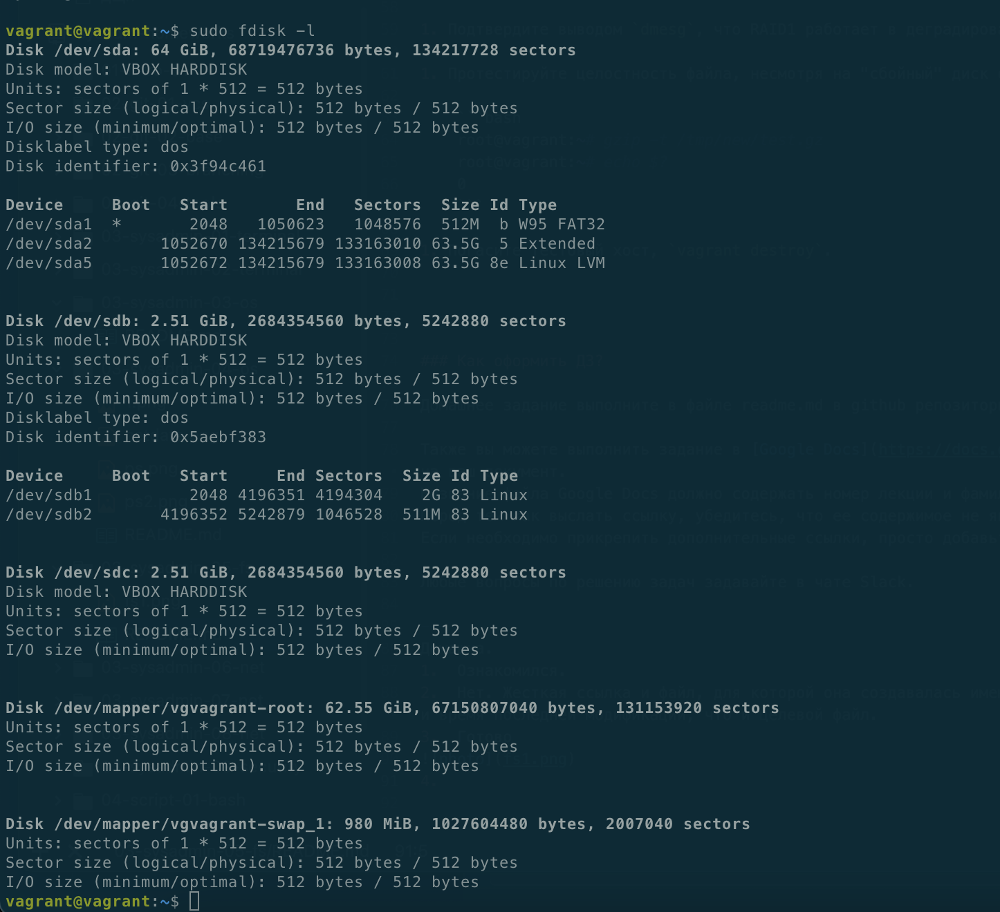

# Домашнее задание к занятию "3.5. Файловые системы"

1. Узнайте о [sparse](https://ru.wikipedia.org/wiki/%D0%A0%D0%B0%D0%B7%D1%80%D0%B5%D0%B6%D1%91%D0%BD%D0%BD%D1%8B%D0%B9_%D1%84%D0%B0%D0%B9%D0%BB) (разряженных) файлах.

1. Могут ли файлы, являющиеся жесткой ссылкой на один объект, иметь разные права доступа и владельца? Почему?

1. Сделайте `vagrant destroy` на имеющийся инстанс Ubuntu. Замените содержимое Vagrantfile следующим:

    ```bash
    Vagrant.configure("2") do |config|
      config.vm.box = "bento/ubuntu-20.04"
      config.vm.provider :virtualbox do |vb|
        lvm_experiments_disk0_path = "/tmp/lvm_experiments_disk0.vmdk"
        lvm_experiments_disk1_path = "/tmp/lvm_experiments_disk1.vmdk"
        vb.customize ['createmedium', '--filename', lvm_experiments_disk0_path, '--size', 2560]
        vb.customize ['createmedium', '--filename', lvm_experiments_disk1_path, '--size', 2560]
        vb.customize ['storageattach', :id, '--storagectl', 'SATA Controller', '--port', 1, '--device', 0, '--type', 'hdd', '--medium', lvm_experiments_disk0_path]
        vb.customize ['storageattach', :id, '--storagectl', 'SATA Controller', '--port', 2, '--device', 0, '--type', 'hdd', '--medium', lvm_experiments_disk1_path]
      end
    end
    ```

    Данная конфигурация создаст новую виртуальную машину с двумя дополнительными неразмеченными дисками по 2.5 Гб.

1. Используя `fdisk`, разбейте первый диск на 2 раздела: 2 Гб, оставшееся пространство.

1. Используя `sfdisk`, перенесите данную таблицу разделов на второй диск.

1. Соберите `mdadm` RAID1 на паре разделов 2 Гб.

1. Соберите `mdadm` RAID0 на второй паре маленьких разделов.

1. Создайте 2 независимых PV на получившихся md-устройствах.

1. Создайте общую volume-group на этих двух PV.

1. Создайте LV размером 100 Мб, указав его расположение на PV с RAID0.

1. Создайте `mkfs.ext4` ФС на получившемся LV.

1. Смонтируйте этот раздел в любую директорию, например, `/tmp/new`.

1. Поместите туда тестовый файл, например `wget https://mirror.yandex.ru/ubuntu/ls-lR.gz -O /tmp/new/test.gz`.

1. Прикрепите вывод `lsblk`.

1. Протестируйте целостность файла:

    ```bash
    root@vagrant:~# gzip -t /tmp/new/test.gz
    root@vagrant:~# echo $?
    0
    ```

1. Используя pvmove, переместите содержимое PV с RAID0 на RAID1.

1. Сделайте `--fail` на устройство в вашем RAID1 md.

1. Подтвердите выводом `dmesg`, что RAID1 работает в деградированном состоянии.

1. Протестируйте целостность файла, несмотря на "сбойный" диск он должен продолжать быть доступен:

    ```bash
    root@vagrant:~# gzip -t /tmp/new/test.gz
    root@vagrant:~# echo $?
    0
    ```

1. Погасите тестовый хост, `vagrant destroy`.


 ---

### Как оформить ДЗ?

Домашнее задание выполните в файле readme.md в github репозитории. В личном кабинете отправьте на проверку ссылку на .md-файл в вашем репозитории.

Также вы можете выполнить задание в [Google Docs](https://docs.google.com/document/u/0/?tgif=d) и отправить в личном кабинете на проверку ссылку на ваш документ.
Название файла Google Docs должно содержать номер лекции и фамилию студента. Пример названия: "1.1. Введение в DevOps — Сусанна Алиева"
Перед тем как выслать ссылку, убедитесь, что ее содержимое не является приватным (открыто на комментирование всем, у кого есть ссылка).
Если необходимо прикрепить дополнительные ссылки, просто добавьте их в свой Google Docs.

Любые вопросы по решению задач задавайте в чате Slack.

---
Домашка.  
1.  Ознакомился.  
2.  Нет. Жесткая ссылка и файл, для которой она создавалась имеют одинаковые inode. Поэтому жесткая ссылка имеет те же   права доступа, владельца и время последней модификации, что и целевой файл.  
3.  Готово  
  
4.  Готово  
   
5.  Готово  
  
6.  Готово  
  
7.  Готово  
  
