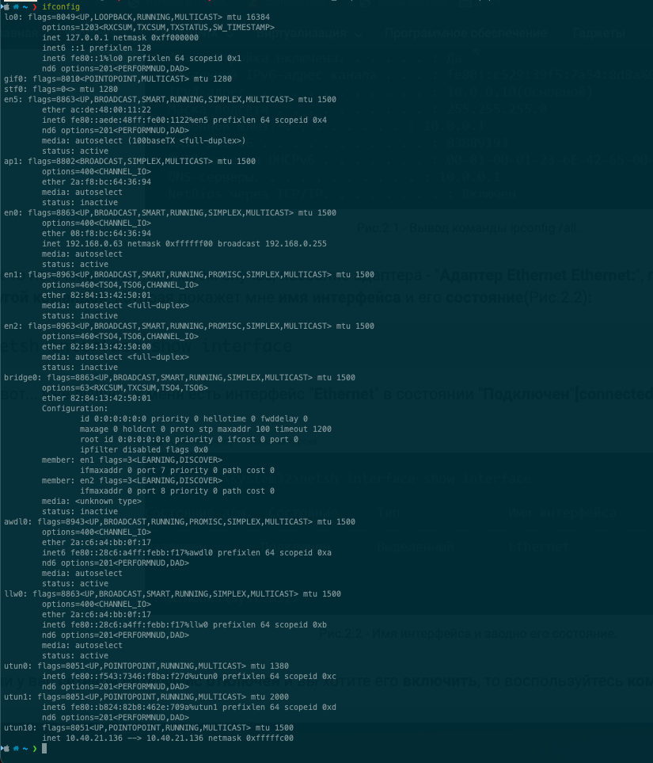

# Домашнее задание к занятию "3.7. Компьютерные сети, лекция 2"

1.  Проверьте список доступных сетевых интерфейсов на вашем компьютере. Какие команды есть для этого в Linux и в Windows?  

2.  Какой протокол используется для распознавания соседа по сетевому интерфейсу? Какой пакет и команды есть в Linux для этого?  

3.  Какая технология используется для разделения L2 коммутатора на несколько виртуальных сетей? Какой пакет и команды есть в Linux для этого? Приведите пример конфига.  

4.  Какие типы агрегации интерфейсов есть в Linux? Какие опции есть для балансировки нагрузки? Приведите пример конфига.  

5.  Сколько IP адресов в сети с маской /29 ? Сколько /29 подсетей можно получить из сети с маской /24. Приведите несколько примеров /29 подсетей внутри сети 10.10.10.0/24.  

6.  Задача: вас попросили организовать стык между 2-мя организациями. Диапазоны 10.0.0.0/8, 172.16.0.0/12, 192.168.0.0/16 уже заняты. Из какой подсети допустимо взять частные IP адреса? Маску выберите из расчета максимум 40-50 хостов внутри подсети.  

7.  Как проверить ARP таблицу в Linux, Windows? Как очистить ARP кеш полностью? Как из ARP таблицы удалить только один нужный IP?  

# Решение  

1.  Вот список  
  
ifconfig  
ipconfig   

2.  Протокол обнаружения соседей (англ. Neighbor Discovery Protocol, NDP ) — протокол из набора протоколов TCP/IP, используемый совместно с IPv6.  
ip neighbor  
ip ndp -an  
netsh interface ipv6 show neighbors level=verbose  

3.  Это технология VLAN.  
vconfig add eth0 5  
ifconfig eth0.5 192.168.1.100 netmask 255.255.255.0 broadcast 192.168.1.255 up  

4.  Linux поддерживает несколько режимов агрегации интерфейсов:

-- (balance-rr) — round-robin распределение пакетов между интерфейсами. Обеспечивает отказоустойчивость и повышение пропускной способности.  
-- (active-backup) — в каждый момент времени работает только один интерфейс, в случае его выхода из строя, mac-адрес назначается второму интерфейсу и трафик переключается на него.  
-- (balance-xor) — обеспечивает балансировку между интерфейсами на основании MAC-адресов отправителя и получателя.  
-- (broadcast) — отправляет пакеты через все интерфейсы одновременно, обеспечивает отказоустойчивость.  
-- (802.3ad) — обеспечивает агрегацию на основании протокола 802.3ad.  
-- (balance-tlb) — в этом режиме входящий трафик приходит только на один «активный» интерфейс, исходящий же распределяется по всем интерфейсам.  
-- (balance-alb) — балансирует исходящий трафик как tlb, а так же входящий IPv4 трафик используя ARP.  
mode 1-6 соответственно!  
Для балансировки balance-rr, balance-xor, balance-tlb, balance-alb.  
cat /etc/network/interfaces  
-- The loopback network interface  
auto lo  
iface lo inet loopback  

-- The primary network interface  
auto bond0 eth0 eth1  
-- настроим параметры бонд-интерфейса  
iface bond0 inet static  
-- адрес, маска, шлюз. (можно еще что-нибудь по вкусу)  
        address 10.0.0.11  
        netmask 255.255.255.0  
        gateway 10.0.0.254  
        -- определяем подчиненные (объединяемые) интерфейсы  
        bond-slaves eth0 eth1  
        -- задаем тип бондинга  
        bond-mode balance-alb  
        -- интервал проверки линии в миллисекундах  
bond-miimon 100  
        -- Задержка перед установкой соединения в миллисекундах  
bond-downdelay 200  
-- Задержка перед обрывом соединения в миллисекундах  
        bond-updelay 200  

5.  Сколько IP адресов в сети с маской /29 - 8шт.  
Сколько /29 подсетей можно получить из сети с маской /24 -  
/29 - 8 подсети  
/24 - 256 подсети  
256/8=32  

Сеть:10.10.10.0/29  
Хост(min):10.10.10.1  
Хост(max):10.10.10.6  
Broadcast:10.10.10.7  

Сеть:10.10.10.8/29  
Хост(min):10.10.10.9  
Хост(max):10.10.10.14  
Broadcast:10.10.10.15  

и тд всего 32.  
6.  
Можно взять от сюда 100.64.0.0/10  
к примеру  

Сеть:100.64.0.0/26  
Хост(min):100.64.0.1  
Хост(max):100.64.0.62  
Broadcast:100.64.0.63  
  
7.  Arp -a
удалить запись - использовать флаг -d
arp -d 192.168.1.100 для примера
для линукс и винды одинаково.
