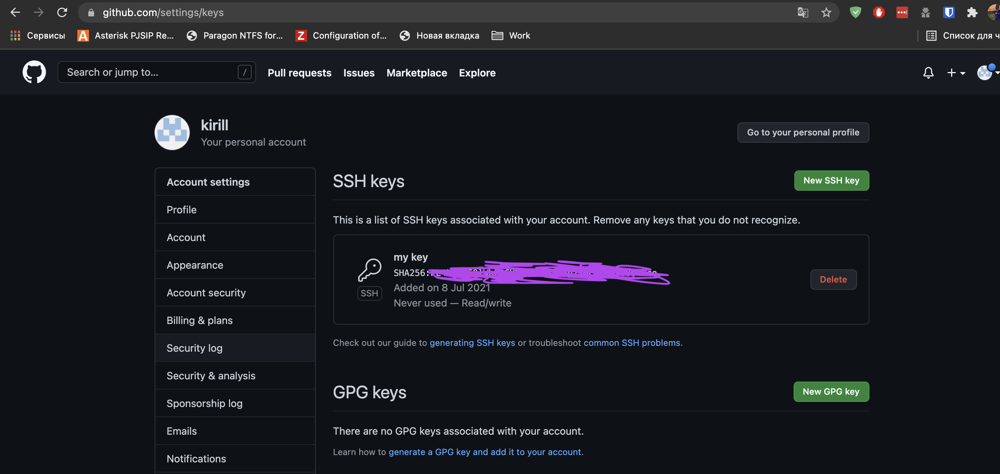

1.  Установите Bitwarden плагин для браузера. Зарегестрируйтесь и сохраните несколько паролей.

2.  Установите Google authenticator на мобильный телефон. Настройте вход в Bitwarden акаунт через Google authenticator OTP.

3.  Установите apache2, сгенерируйте самоподписанный сертификат, настройте тестовый сайт для работы по HTTPS.

4.  Проверьте на TLS уязвимости произвольный сайт в интернете.

5.  Установите на Ubuntu ssh сервер, сгенерируйте новый приватный ключ. Скопируйте свой публичный ключ на другой сервер. Подключитесь к серверу по SSH-ключу.

6.  Переименуйте файлы ключей из задания 5. Настройте файл конфигурации SSH клиента, так чтобы вход на удаленный сервер осуществлялся по имени сервера.

Соберите дамп трафика утилитой tcpdump в формате pcap, 100 пакетов. Откройте файл pcap в Wireshark.

## Домашка
1.  
  

2.  Нет возможности установить на телефон Google authenticator. Принцип понятен. На данный момент   работаем через FReeOTP
3.  

4.  
ß
5.  Ключом пользуюсь постоянно.  

